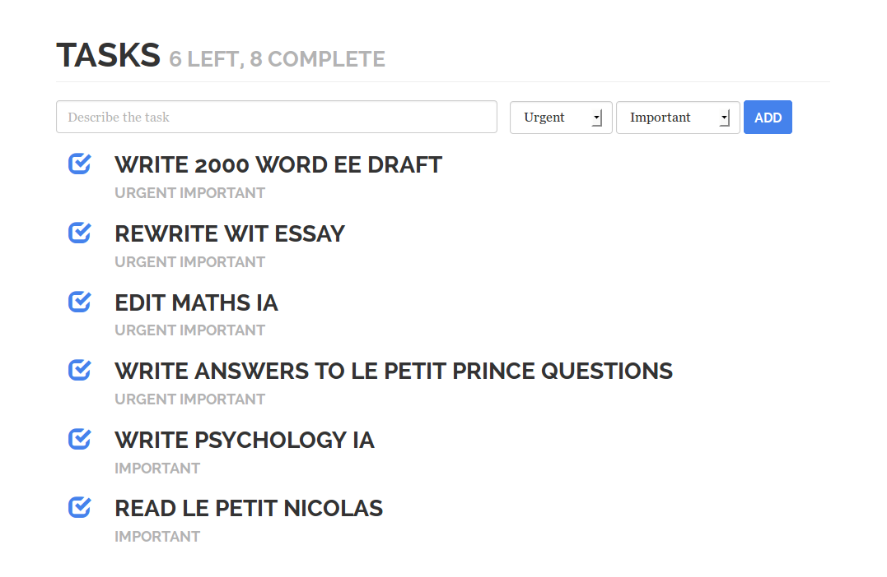

Task manager — Example project for Meteor.js
============================================

This is an example project for Meteor.js 0.6. It works like a task manager, allowing you to add and remove tasks with urgency and importance.

Run by running `meteor` and then go to `localhost:3000` in browser.

Licensed under MIT license to Liam Edwards-Playne.
